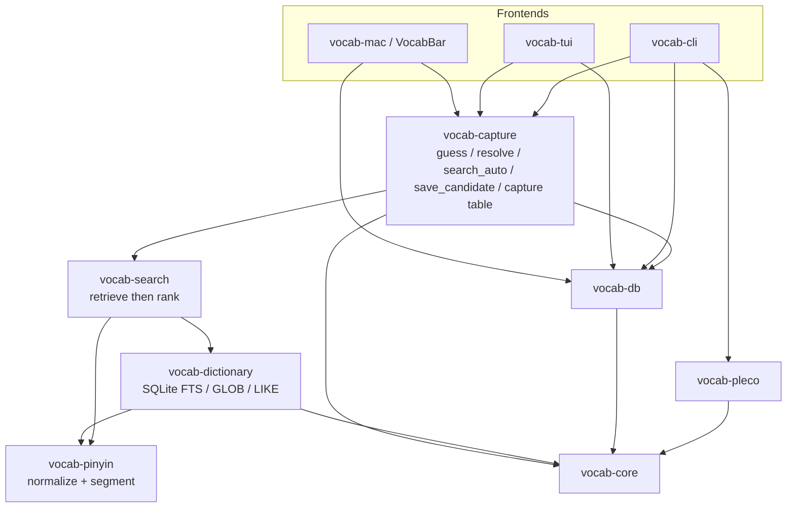

# Dev notes

For humans and agents. User-facing usage is in [README.md](README.md).

## Architecture




## Workspace

| Crate | Role |
| --- | --- |
| `vocab-core` | Types, statuses, errors |
| `vocab-dictionary` | Ingest + SQLite dictionary |
| `vocab-search` | Ranked search |
| `vocab-pinyin` | Normalize / segment pinyin |
| `vocab-pleco` | Pleco UTF-8 text codec |
| `vocab-db` | `user.db` |
| `vocab-capture` | Shared search / save / CLI add |
| `vocab-tui` | Terminal UI |
| `vocab-mac` | Menu-bar app (VocabBar) |
| `vocab-cli` | `vocab` |

Two files, never mixed:

| File | Role |
| --- | --- |
| `dictionary.db` | Read-only lexicon (CEDICT + frequency + HSK) |
| `user.db` | Saved vocab, import/export audit |

Runtime path for `dictionary.db`: `--dictionary` → `VOCAB_DICTIONARY` →
`data/dictionary/dictionary.db` walking up from the current directory →
`~/Library/Application Support/pleco-companion/dictionary.db`.

## Search path

```
query
  → mode: explicit, or guess_mode, or resolve_auto
  → retrieve (do not drop)
      English: FTS5 token + prefix + trigram
      Pinyin:  normalize → segment → GLOB syllable patterns
      Chinese: exact / prefix, then character AND fallback (inferred)
  → rank (never drop)
      lemma match → other match quality → frequency → HSK → entry_id
  → UI/CLI may cap display (VocabBar: 10)
```

## Principles

1. Retrieval is not translation — English returns candidates; the user picks.
2. No silent uncertainty — ambiguity and missing data become `needs_review`.
3. Deterministic — same DB + query ⇒ same order.
4. Provenance is kept on every saved item.
5. Future Pleco support is file-based UTF-8 text, never `.pqb`.

VocabBar log: `tail -f ~/Library/Logs/VocabBar/debug.log`.


`resolve_auto`: guess first; if English hits are not an exact lemma and the
query looks like untoned multi-syllable pinyin (`jingzi`, `nihao`), fall
through to pinyin. Weak English (names like “Jintian Uprising”) must not
block that.

Where to change what:

| Change | Crate / file |
| --- | --- |
| Ranking / lemma rules | `vocab-search/src/ranker.rs` |
| SQL retrieval, FTS, ingest | `vocab-dictionary/src/sqlite.rs` |
| Pinyin normalize/segment | `vocab-pinyin` |
| Auto mode / picker search+save / CLI add table | `vocab-capture` (`resolve`, `search_auto`, `save_candidate`, `capture`) |
| VocabBar | AppKit only; search `search_auto`, save `save_candidate`; row labels in `vocab-mac/src/capture.rs` |
| TUI | ratatui only; search `resolve`, save `save_candidate` |

Do not pull tantivy/fuzzy matchers for dictionary lookup. FTS5 is retrieval;
ranking is domain-specific.

## Save path

Two APIs in `vocab-capture`:

Picker search: `resolve` (explicit mode) or `search_auto` (auto + display cap).
Picker save: `save_candidate` — TUI and VocabBar persist the **selected** hit.

`capture` / `capture_to_path` (CLI `add` only):

| Matches | Result |
| --- | --- |
| 1 strong (non-inferred) | insert `confirmed` |
| 0 | insert `needs_review` (raw query) |
| 2+ strong | save nothing; return candidates |

## Ingest / fetch

Default path: `ensure_dictionary_db` (first launch, monthly refresh, or
`cargo run -p vocab-dictionary --example ensure`).

Bring-your-own lexicon still uses the ingest example:

```
CEDICT .u8 + optional frequency TSV + HSK CSV
  → vocab-dictionary example ingest
  → dictionary.db
```

Frequency: OpenSubtitles `word count` lines, rank 1 = most common.
HSK: level 1–7 (`7-9` stored as 7). Unlisted entries sort last.

Downloaded sources land in `data/dictionary/sources/` (gitignored).

## Conventions

- Rust 1.85+, workspace `edition = 2024`.
- `unsafe_code = forbid` except `vocab-mac` (ObjC/Carbon wrappers only).
- Clippy `all` + `pedantic`, zero warnings (`-D warnings`).
- No comments in code unless asked. Docs belong here or in crate rustdoc.
- Fixtures are the contract (`fixtures/`). Do not “fix” tests by weakening them
  without a product decision.
- Never commit secrets, `dictionary.db`, or `user.db`.

## Tests

Product I/O first (query/file in, headword/item out). Sample-dict unit tests
stay on `fixtures/dictionary/cedict-sample.u8` for parser/ranker edges.

| Gate | What |
| --- | --- |
| `./scripts/check.sh` | `fmt --check`, clippy `-D warnings`, `cargo test --workspace` |
| pre-commit | `./scripts/setup-hooks.sh` → `scripts/githooks/pre-commit` |
| CI | `.github/workflows/ci.yml` (macOS, same `check.sh`) |

`open_service` fetches `dictionary.db` if missing and refreshes it when the
calendar month changes (`vocab-dictionary::ensure_dictionary_db`). Tests set
`VOCAB_SKIP_DICTIONARY_REFRESH=1` (see `scripts/check.sh`). Manual rebuild:
`cargo run -p vocab-dictionary --example ensure -- --force`.

I/O coverage:

- `vocab-cli/tests/e2e.rs` — real `vocab` binary: search / add / list / import / export
- `vocab-tui` / `vocab-mac` `search_quality` — query in, headword in top 10
- Probes: `fixtures/search/top1000.tsv` (regen: `python3 fixtures/search/generate.py`)
- 50-word smoke includes English; 1000-word sweep is pinyin + hanzi
- Pleco fixtures under `fixtures/pleco/`

Do not “fix” a failing I/O test by loosening it.

## Layout cheat sheet

```
crates/vocab-*     library + binaries
scripts/install.sh macOS install (CLI, TUI, VocabBar)
scripts/check.sh   fmt + clippy + all tests
scripts/setup-hooks.sh  git pre-commit → check.sh
data/dictionary/   ingest inputs + dictionary.db
fixtures/          golden files + search probes
DEV.md             this file
```
