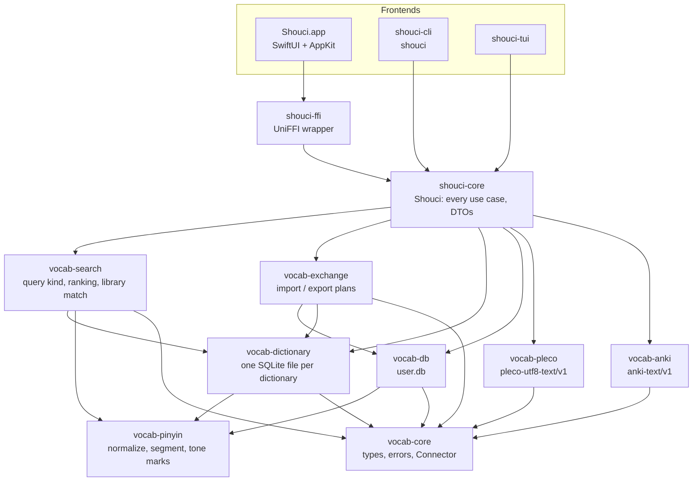

# Dev notes

For humans and agents. What people do with Shouci is in
[README.md](README.md); the Mac app's internals are in
[macos/README.md](macos/README.md).

## Architecture


```mermaid
flowchart TB
  subgraph frontends [Frontends]
    MAC["Shouci.app\nSwiftUI + AppKit"]
    CLI["shouci-cli\nshouci"]
    TUI["shouci-tui"]
  end

  FFI["shouci-ffi\nUniFFI wrapper"]
  CORE["shouci-core\nShouci: every use case, DTOs"]

  SRCH["vocab-search\nquery kind, ranking, library match"]
  XCH["vocab-exchange\nimport / export plans"]
  DICT["vocab-dictionary\none SQLite file per dictionary"]
  UDB["vocab-db\nuser.db"]
  PY["vocab-pinyin\nnormalize, segment, tone marks"]
  PLECO["vocab-pleco\npleco-utf8-text/v1"]
  ANKI["vocab-anki\nanki-text/v1"]
  VC["vocab-core\ntypes, errors, Connector"]

  MAC --> FFI --> CORE
  CLI --> CORE
  TUI --> CORE

  CORE --> SRCH
  CORE --> XCH
  CORE --> DICT
  CORE --> UDB
  CORE --> PLECO
  CORE --> ANKI

  XCH --> UDB
  XCH --> DICT
  SRCH --> DICT
  SRCH --> PY
  DICT --> PY
  UDB --> PY

  PLECO --> VC
  ANKI --> VC
  XCH --> VC
  SRCH --> VC
  DICT --> VC
  UDB --> VC
```

Two boundaries, checked on every run of `scripts/check.sh`
(`scripts/check-deps.sh`, which reads `cargo metadata`, so no way of
declaring a dependency slips past; `scripts/check-deps-test.sh` proves it
refuses each one):

- **Frontends depend on `shouci-core` only.** The CLI, the TUI, and the FFI
  crate never reach past it, so every UI is a projection of the same core
  and a rule lives in one place.
- **Connectors depend on `vocab-core` only.** A file format never sees
  storage, the dictionary, or the exchange engine.

## Workspace

| Crate | Role | Binary |
| --- | --- | --- |
| `vocab-core` | Item model, dictionary entry, `VocabError` and `ErrorKind`, the `Connector` trait | |
| `vocab-pinyin` | Normalize, segment unspaced pinyin, tone marks ↔ numbers | |
| `vocab-dictionary` | Build, find, and query dictionaries; first-run fetch and monthly refresh | |
| `vocab-search` | Query detection, automatic search, ranking, matching the user's library | |
| `vocab-db` | `user.db`: words, tags, collections, transfer ledger, settings, migrations, POC import | |
| `vocab-exchange` | Import and export as plan, then apply; knows connectors only by the trait | |
| `vocab-pleco` | Pleco flashcard text as a `Connector` | |
| `vocab-anki` | Anki note text as a `Connector` | |
| `shouci-core` | `Shouci`: one facade for every use case, returning serializable DTOs | |
| `shouci-ffi` | The core for Swift through UniFFI (static library and XCFramework) | |
| `shouci-cli` | Command line | `shouci` |
| `shouci-tui` | Terminal UI (ratatui) | `shouci-tui` |

The Mac app is not a crate: it is the Xcode project in `macos/`, linking
`shouci-ffi` as `macos/ShouciCore/ShouciFFI.xcframework`.

## Data

Two kinds of file, never mixed:

| File | Role |
| --- | --- |
| `user.db` | Saved words, tags, collections, smart collections, the transfer ledger, settings. Written. |
| `dictionaries/<id>.db` | One per dictionary, read-only, describing itself in `dictionary_metadata`. `cc-cedict.db` is CC-CEDICT with OpenSubtitles frequency and HSK 3.0 levels. |

Where they are (`Config::from_env`):

1. `SHOUCI_HOME`, else `~/Library/Application Support/Shouci` on macOS, else
   `$XDG_DATA_HOME/shouci`, else `~/.local/share/shouci`. Holds `user.db`.
2. `SHOUCI_DICTIONARIES`, else `dictionaries/` inside that.

The app, the CLI, and the TUI all read the same library.

`user.db` runs in WAL mode with a busy timeout, so the app and the CLI can
write at once. Its schema version is `PRAGMA user_version`;
`vocab-db/src/migrate.rs` appends migrations and never edits a shipped one.
Before anything writes to a database, it must be empty or hold every table
and column its version should have (what the migrations build up to it);
anything else, such as another program's database or a newer Shouci's, is
refused and left as it is.
In a checkout, `data/dictionaries/` is where the build that tests and CI use
goes (`check.sh` points `SHOUCI_DICTIONARIES` there). It is not committed:
the first run of `check.sh` downloads and builds it.

## The core

`shouci_core::Shouci` is opened once per process and is `Send + Sync`.

- **Every use case is a method**: search, save, quick add, add by hand,
  edit, bulk actions (archive, trash, restore, purge, tags, collections),
  dictionaries, import, export. Frontends render what comes back.
- **DTOs** (`shouci-core/src/dto.rs`) carry raw fields for editing
  (`pinyin: "xue2 xiao4"`) beside display fields (`pinyin_display: "xué
  xiào"`), so no frontend formats pinyin or definitions itself. They are the
  projection contract: the CLI prints them with `--json`, and the FFI
  restates them for Swift. Change them additively.
- **Two connections**: writes go through one, reads (search, listings,
  previews) through another, so a long import never blocks search.
  `data_version()` changes whenever the library does, from this process or
  another; the Mac window polls it.
- **Dictionaries load separately.** `open` is fast; `load_dictionaries`
  blocks while it opens what is on disk, then (when the config allows)
  downloads missing built-ins and refreshes stale ones. Search works as soon
  as `dictionary_status()` is `Ready`, even while `updating`. The app loads
  in the background with fetching on; the CLI and TUI load with fetching off,
  and fetch only when no dictionary is installed at all.
- **Errors** are `VocabError` with an `ErrorKind` (`not_found`, `conflict`,
  `invalid`, `unavailable`, `format`, `io`, `storage`, `internal`). Messages
  are written for people; frontends show them as they are.

A saved word has two independent axes, **verification** (`confirmed`,
`needs_review`) and **lifecycle** (`active`, `archived`, `trashed`), plus a
**source** (dictionary, import, or manual) and a `rev` that rises with every
change. Its identity is the simplified form, the traditional form, and the
reading ignoring how tones are written; saving the same word twice changes
nothing.

A word's **HSK level and frequency rank** (`ItemView::hsk_rank`,
`frequency_rank`) are looked up in the loaded dictionaries every time it is
read, never stored with it (`shouci-core/src/ranks.rs`). The dictionaries
rank a headword's simplified form, so the lookup is a table by simplified
form, built once per load on the loading thread. Before the dictionaries
load, words have none; the Mac window reloads when they are ready.

A **filter** (`LibraryFilter`) narrows listings, search, and export. Every
condition must hold; within one that names several values (HSK levels,
tags any of which will do), any value does. The database answers the
conditions it can (`vocab-db` `list_items`: tags, collections, status,
when added); the core checks HSK levels and frequency bands against the
rank table (`library::admits`), since only the dictionaries know them.
`Shouci::matching_ids` gives just the ids, for a frontend that holds the
library itself (the Mac window).

A **smart collection** is a name and a filter, kept as JSON in
`smart_collections` (`vocab-db/src/smart.rs`); its words are worked out each
time it is read, never stored. JSON lets a later version add a condition
without a migration, so `LibraryFilter`'s field names and `FrequencyBand`'s
stored names (`top1000`, `unlisted`) are a storage format: pinned by
`json_shapes_are_stable`. Renaming or merging a tag or collection renames it
in every filter in the same transaction (`organize.rs` calls
`smart::follow_rename`), and undoing it puts the old filter back, so a smart
collection keeps finding the same words. Turning a tag into a collection
asks for the collection instead, where the filter can say it that way
(`smart::follow_tag_to_collection`); a filter that keeps words out of
collections keeps asking for the tag.

**Undo** is two calls (`shouci-core/src/undo.rs`). A frontend reads the words
a change touches before and after it (`Shouci::snapshot`); undoing restores
the first reading and redoing the second (`Shouci::restore`). A snapshot
holds the words with their tags and collections, every tag and collection
name, and every smart collection's filter, so one mechanism covers edits,
archive and trash, tags and collections, renames, merges, and deletes, and
smart collections. A word a change saved is missing from the first
snapshot: undoing deletes it for good, and redoing puts it back with its id
(`vocab_db::reinsert_item`; ids are never reused). A frontend saving a typed
word reads the word it would change first (`Shouci::manual_match`), so a
word brought back from the Trash goes back there. A restore refuses,
changing nothing, when a word or smart collection is no longer as the
change left it, so an undo never overwrites what another window, quick
search, or `shouci` did since; a word deleted for good while the change ran
is one the snapshot after it found missing, so an undo doesn't bring it
back. Words are compared by what they hold, not by
`rev`, so undoing several changes in turn works.

## Search path

```
query (at most 100 characters)
  → kind: given, or search_auto:
      detect() first (characters → Hanzi; tone digits or marks → pinyin;
      anything else → English), then the other kinds; the first that
      finds anything wins. English hits that are not a whole gloss don't
      stop untoned pinyin (`nihao`, `jintian`) from being tried.
  → retrieve (never drop)
      English: FTS5 tokens + prefix + trigram
      Pinyin:  normalize → segment → GLOB syllable patterns
      Hanzi:   exact / prefix; then entries with every character (inferred);
               then dictionary words inside the query (蚌埠 in 蚌埠住了)
  → rank (never drop)
      match quality (exact gloss, gloss prefix, …) → dictionary priority →
      frequency → HSK → entry id
      English: an exact sense leads only for a word with a frequency or an
      HSK level, and a word outside both the top 10,000 and HSK gives up
      places (热 before 暍 for `hot`, 刻 before 屯驻 for `quarter`)
  → frontends cap what they show (quick search 8, CLI 20, TUI 50)
```

Saving:

| Call | What is saved |
| --- | --- |
| `save_candidate` | The chosen result. Confirmed, unless it was inferred from its characters (then needs review). A word from the trash comes back; a placeholder saved without a reading is completed. |
| `quick_add` (CLI `add`) | One result that is the query itself (same characters, same toneless reading, or a gloss that is exactly the English) → saved, confirmed. For English, several such results, of which the first has the English as its main sense and is more common than every other word with that main sense → the first (`school` → 学校; `to` stays a choice). Otherwise one strong match → saved. No match, or only words inside the text → Chinese text as typed, needs review (anything else, such as a typo, is refused). Several strong matches → nothing; the candidates come back. |
| `add_manual` | A word typed in. A missing traditional form (and reading) comes from the dictionary when exactly one entry fits. Confirmed only with a reading and a definition. |

Library search (`search_library`) matches in memory over every saved word
(hundreds to a few thousand): Hanzi, pinyin with or without tones, or
English in definitions and notes.

## Transfer path

`vocab-exchange` owns the file boundary; connectors only turn bytes into
records and back.

Import:

```
preview_import(path, connector, policy, force)   or detect_import (best fit)
  → read, strip a byte-order mark, connector.parse → records + line issues
  → resolve each word against the dictionaries, fold repeated words
  → plan: per line insert / update / skip / drop, with the file's SHA-256
    and each affected word's rev
apply_import(plan)
  → refuse (conflict) if the file or any affected word changed since
  → one transaction: words, tags, collections, ledger rows
```

- **Error lines refuse the whole import** unless `force`, which skips them.
- **The same word** is the same characters and reading, however the tones
  are written or spaced. When the file writes a word differently from the
  one dictionary entry it can be, the entry is used and the line gets a
  warning: a variant traditional form (Pleco's 週圍 for 周圍), or a neutral
  tone where the entry has a full one (`deng3deng5` for 等等, `deng3 deng3`).
  Only the file's neutral tones give way, and only when exactly one entry
  fits. A word saved the way the file writes it still counts as the same
  word.
- **Existing words** follow the policy for their text: `merge` (the default
  in every frontend, `ImportPolicy::default()`: fill blanks; differences are
  reported and the saved value kept; a word in the trash comes back),
  `skip` (keep the text; a word in the trash stays there), `overwrite`
  (replace each field the file fills in). Every policy adds the file's tags
  and collections.
- **Nothing is lost**: a blank or missing field never changes a saved word,
  and tags and collections are only ever added.
- **Names** are the library's own when only case, spaces, or underscores
  differ (`week 1`, `Week_1` → `Week 1`; Anki writes spaces in tags as
  `_`), so a file never splits one tag or collection in two.
- **Format detection** (`detect_import`) previews with every connector and
  keeps the one with the fewest error lines, then the fewest unresolved or
  dropped words. It also says whether the choice was unambiguous (no other
  connector read the file as well), which the Mac app shows as Detected.

Export:

```
preview_export(path, connector, request)
  → refuse the trash, and any path that was imported from
  → pick words: scope new (default) / all / selected, then the filter;
    needs-review words are left out unless asked for
  → connector.write → bytes in memory; flag a file that would be replaced
apply_export(plan)
  → atomic file write, then one transaction recording the run
```

"New" is per destination: words never exported there and never imported
from it. The ledger (`transfer_runs`, `transfer_items`) answers that. The
file write and the ledger commit are each atomic but not together: the file
lands first, so a failed commit leaves an unrecorded file.

Connectors:

| Connector | Format | Notes |
| --- | --- | --- |
| `pleco` | `characters <tab> pinyin <tab> definition`; `//Category` lines | Categories are collections; `简体[繁體]` carries traditional; a definition identical to the dictionary's is left out so Pleco shows its own |
| `anki` | Tab-separated notes with `#separator`, `#deck`, `#columns`, … headers | The deck is a collection; missing columns are omitted, never read as empty; spaces in tags become `_` |

To add a format: a crate that depends on `vocab-core` and implements
`Connector`, an optional dependency and feature in `shouci-core/Cargo.toml`,
and one line in `shouci-core/src/connectors.rs`.

## Dictionaries

`ensure_dictionary_db` (`vocab-dictionary/src/fetch.rs`) builds a missing
dictionary and refreshes one fetched in an earlier calendar month.
`SHOUCI_SKIP_DICTIONARY_REFRESH=1` turns refreshing off (tests set it).

- Downloads land in `sources/` next to the database.
- One process fetches at a time: `<id>.fetch.lock` sits beside the database.
  Others wait (polling every 250 ms, up to 15 minutes for a first build);
  a lock untouched for 30 minutes is treated as abandoned.
- A build goes to `<id>.building.db` and is renamed into place, so a failed
  refresh leaves the working copy alone and comes back as a note.
- `<id>.fetched` holds the `YYYY-MM` it was fetched.
- Rebuilds are byte-identical from the same sources (`tests/determinism.rs`).

Frequency is OpenSubtitles word counts (rank 1 is most common). HSK is 3.0
levels 1–9, the advanced band `7-9` stored as 7; a word listed twice keeps
its easier level. Unlisted words sort last.

Several dictionaries search as a `DictionarySet` in priority order (the
`dictionaries.enabled` setting); the same word in two keeps the
higher-priority entry. By hand:

```sh
cargo run -p vocab-dictionary --example ensure -- [--force] data/dictionaries/cc-cedict.db
cargo run -p vocab-dictionary --example ingest -- <cedict.u8> <out.db> [--frequency FILE] [--hsk FILE]
```

## Frontends

- **`shouci-cli`**: `main.rs` (arguments and one function per command),
  `text.rs` (results as lines), `words.rs` (naming a saved word by id or
  characters). Results go to stdout, notes and progress to stderr. `--json`
  prints the core's DTOs; errors become `{"error": {"kind", "message"}}`.
  Exit status 0, 1 for an error or nothing saved, 2 for a usage error.
- **`shouci-tui`**: `app/` is the state and its methods, by job: `mod.rs`
  (the state, key routing, the event loop), `search.rs`, `saved.rs`,
  `prompt.rs` (import and export), and `render.rs` (drawing). `state.rs`
  and `ui.rs` are pure helpers, tested without a terminal; `theme.rs`
  (`NO_COLOR` gives monochrome). Dictionaries load before the TUI takes the
  screen. File panels come from `rfd`, with a typed path as the fallback.
- Wording both text frontends print (`counted`, what an import changed)
  lives once, in `shouci_core::text`.
- **Mac app**: [macos/README.md](macos/README.md). Every core call goes
  through `AppModel.call`, off the main thread.

## Where to change what

| Change | Where |
| --- | --- |
| A use case, or what a frontend receives | `shouci-core` (`dto.rs` for shapes) |
| Ranking | `vocab-search/src/ranker.rs` |
| How a query is read, automatic search | `vocab-search/src/query.rs`, `vocab-search/src/lib.rs` |
| Retrieval SQL, FTS | `vocab-dictionary/src/sqlite.rs` |
| Source parsers (CEDICT, frequency, HSK) | `vocab-dictionary/src/{cedict,frequency,hsk}.rs` |
| Definitions as shown | `vocab-dictionary/src/display.rs` |
| Pinyin rules | `vocab-pinyin` (pinned by `fixtures/pinyin/NORMALIZATION.md`) |
| Import and export rules | `vocab-exchange/src/{import,export,resolve}.rs` |
| A file format | its connector crate |
| Schema | a new migration in `vocab-db/src/migrate.rs` |
| A filter condition | `LibraryFilter` (`vocab-core/src/item.rs`); the SQL in `vocab-db` `items::conditions`, or `admits_ranks` if it needs the dictionaries; its wording in `shouci-core` `text::filter_conditions`; `shouci-cli` `Conditions` (and `--smart`'s conflicts); the Mac `FilterPanel.swift` |
| CLI commands and output | `shouci-cli/src/main.rs`, `text.rs` |
| TUI keys and screens | `shouci-tui/src/app/`, `ui.rs` |
| The Swift API | `shouci-ffi/src/lib.rs` (methods), `remote.rs` (types) |
| A change ⌘Z takes back | through `record` (`macos/Shouci/LibraryUndo.swift`); if it changes what `LibrarySnapshot` doesn't hold, `shouci-core/src/undo.rs` too |
| The Mac app's logic | `macos/Shouci/`, tested in `macos/ShouciTests/` |

Do not pull in tantivy or fuzzy matchers for dictionary lookup. FTS5 is
retrieval; ranking is domain-specific.

## Principles

1. Retrieval is not translation: English returns candidates; the user picks.
2. No silent uncertainty: ambiguity and missing data become `needs_review`.
3. Deterministic: the same dictionaries and query give the same order.
4. Every saved word keeps where it came from.
5. Pleco and Anki are reached through text files, never `.pqb` or `.apkg`.
6. Rules live in the core; frontends render.
7. Imports never lose data, and an export never writes over a file that was
   imported from.

## Conventions

- Rust stable (`rust-toolchain.toml`), 1.85 or later, edition 2024.
- `unsafe_code = "forbid"` across the workspace.
- Clippy `all` + `pedantic`, zero warnings (`-D warnings`). CI takes the
  newest stable Rust, so a new lint can fail CI with no change here; fix it
  the way the lint asks.
- Comments say why, not what. Module docs carry the design.
- Fixtures are the contract (`fixtures/`). Don't "fix" a test by weakening
  it without a product decision.
- Never commit secrets, dictionary builds, downloaded sources, or `user.db`.

## Tests

Product I/O first: a query or file in, a headword or saved word out.

| Gate | What |
| --- | --- |
| `./scripts/check.sh` | crate boundaries, `fmt --check`, clippy `-D warnings`, `cargo test --workspace` (fetches the dictionary if missing) |
| pre-commit | `./scripts/setup-hooks.sh` → `scripts/githooks/pre-commit` runs `check.sh` |
| CI | `.github/workflows/ci.yml` on macOS: `check.sh`, then the Mac app (`build-core.sh`, `swift test`, `xcodebuild test`) |

Coverage:

- `shouci-core/tests/use_cases.rs`: every use case, end to end, on the
  sample dictionary.
- `shouci-core/tests/search_quality.rs`: the real CC-CEDICT build against
  `fixtures/search/top1000.tsv` (regenerate with
  `python3 fixtures/search/generate.py`). Top 50 by English, pinyin, and
  Hanzi, with and without a kind; verbs searched with "to"; a 1000-word
  pinyin and Hanzi sweep. The word must be in the first 10.
- `shouci-cli/tests/e2e.rs`: the `shouci` binary in a scratch library.
- `shouci-tui` unit tests: key presses against a sandbox, and drawing with
  ratatui's `TestBackend`.
- `shouci-ffi/tests/core.rs` and `macos/ShouciCore/Tests`: the Swift-facing
  API, from Rust and from Swift.
- `macos/ShouciTests`: the Mac app's own logic (`xcodebuild … test`): the
  list's sorting and headings, name suggestions, and the library window's
  model against a scratch library, with undo and redo, filing, smart
  collections, and where problems show. The target compiles the app's
  sources rather than launching the app, so tests never touch the real
  library, settings, or shortcut.
- `vocab-exchange/tests/engine.rs`: import and export rules.
- `vocab-pleco` and `vocab-anki` `tests/golden.rs`: each format's grammar
  and round trips.
- `vocab-dictionary/tests/`: retrieval and byte-identical rebuilds.
- `vocab-search/tests/auto.rs` and the ranker's unit tests.

`shouci_core::testing` (the `test-support` feature) gives frontends a real
core to test against: `sandbox()` is a scratch library with the sample
dictionary loaded, `empty_sandbox()` has none.

Don't "fix" a failing I/O test by loosening it.

## Layout cheat sheet

```
crates/vocab-*          libraries
crates/shouci-core      the core every frontend uses
crates/shouci-ffi       the core for Swift
crates/shouci-cli       shouci
crates/shouci-tui       shouci-tui
macos/                  the Mac app (Xcode project, Swift package, scripts)
scripts/install.sh      install the app, shouci, and shouci-tui
scripts/release.sh      a GitHub release with the disk image
scripts/check.sh        boundaries + fmt + clippy + all tests
scripts/setup-hooks.sh  git pre-commit → check.sh
data/dictionaries/      the dictionary build tests use (not committed)
fixtures/               golden files and search probes
DEV.md                  this file
```
