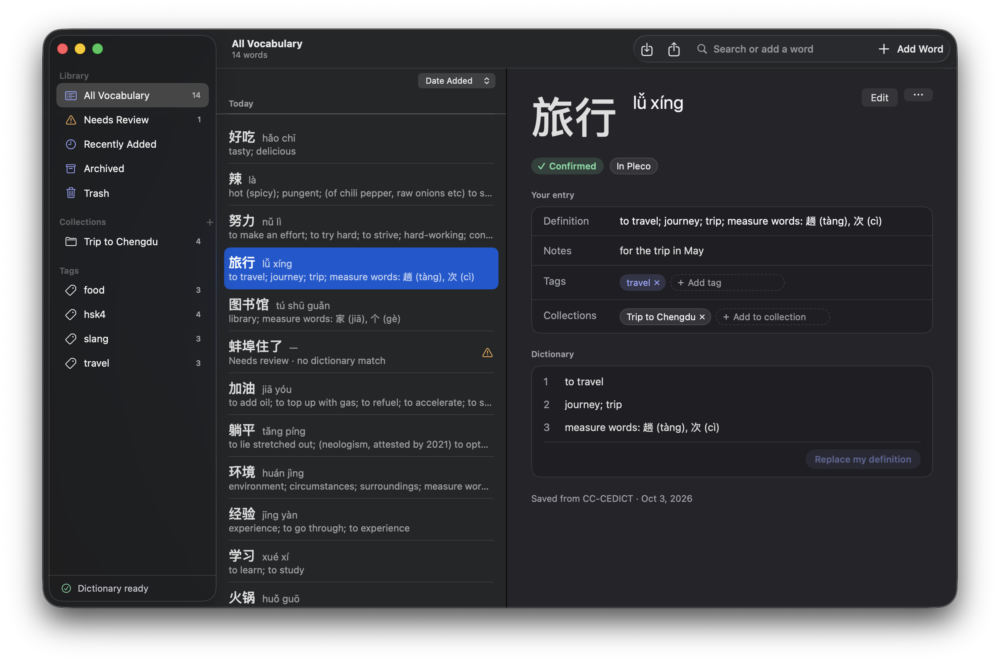
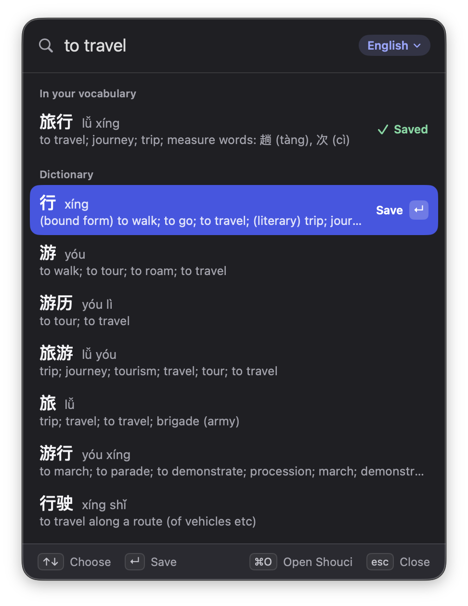

# Shouci (收词)

Collect Chinese vocabulary without leaving what you're doing. Press a
shortcut, type English, pinyin, or characters, pick the word, press Return.
Later, study the words in Pleco or Anki.

Free and open source (MIT). Your words stay on your Mac: Shouci has no
account and goes online only to download its dictionary.

Shouci is free. If it helps you, you can buy me a coffee:

<a href="https://buymeacoffee.com/zacharyzampa"></a>

Want to help? [CONTRIBUTING.md](CONTRIBUTING.md). How it's built:
[DEV.md](DEV.md) and [macos/README.md](macos/README.md).

## Install (macOS)

### Download

Get the `.dmg` from [Releases](https://github.com/ZacharyZampa/Shouci/releases/latest),
open it, and drag Shouci to Applications. It needs macOS 14 or later.

macOS blocks it the first time, because there is no paid Apple developer
account behind Shouci to sign it with: open System Settings › Privacy &
Security, scroll to the message about Shouci, and choose **Open Anyway**. The
dictionary downloads when you first open it. The download is the app only; the
`shouci` and `shouci-tui` terminal tools come with building from source.

### Build from source

You need:

- macOS 14 or later
- **Xcode**, free from the App Store. The Command Line Tools alone are not
  enough. After installing it, run once:
  `sudo xcode-select -s /Applications/Xcode.app/Contents/Developer`
- **Rust**, from [rustup.rs](https://rustup.rs)
- An internet connection the first time, to download the dictionary

Then:

```sh
git clone https://github.com/ZacharyZampa/Shouci.git
cd Shouci
./scripts/install.sh
```

This downloads and builds the dictionary, builds Shouci for Apple silicon and
Intel, installs it to `~/Applications/Shouci.app`, and starts it. Look for
**文** in the menu bar. It also installs `shouci` and `shouci-tui` for the
terminal ([In the terminal](#in-the-terminal)).

Built on your Mac, Shouci is signed to run locally, so Gatekeeper doesn't ask
about it.

| | |
| --- | --- |
| Update | `git pull && ./scripts/install.sh` |
| See what's installed | `./scripts/install.sh --status` |
| Uninstall | `./scripts/install.sh --uninstall` (your words stay; see below) |

## Using Shouci

<p align="center">
  
</p>
<p align="center">
  
</p>

### Quick search

Press **Control-Option-V** anywhere (or click 文). The app you were in stays
in front; Shouci gets out of the way when you're done.

- Type **English** (`to travel`), **pinyin** (`lvxing`, `lǚ xíng`, `lv3xing2`),
  or **characters** (`旅行`). Shouci works out which; the chip beside the
  field shows how it read your search, and its menu changes it.
- **↑ ↓** choose, **Return** saves, **⌘Z** takes the save back, **Esc**
  closes. **⌘O** opens your library.
- Words you already have are marked **Saved**.
- No dictionary entry? Save the characters as **needs review** and fill in
  the reading and meaning later. Shouci also shows the dictionary words found
  inside what you typed (`蚌埠住了` → 蚌埠, 住, 了).

### Your library

Open it with **⌘O** in quick search, right-click 文 › Open Shouci, or open
Shouci from Spotlight. While it's open, Shouci has a Dock icon and menus.

- Browse **All Vocabulary**, **Needs Review**, **Not in a Collection**,
  **Recently Added**, **Archived**, and the **Trash**, or a collection or
  tag. Sort by date, pinyin, **HSK level**, or **frequency** (how common a
  word is); words show their HSK level.
- Search the toolbar field to find saved words and **add** new ones from the
  dictionary.
- Select a word to see your entry next to the dictionary's; **Edit** (or
  Return, or double-click) changes it. **Add Word** (⌘N) adds one by hand.
- Select several words (⌘-click, ⇧-click) to tag them, add them to a
  collection, take a tag or collection off them, mark them for review,
  archive them, export them, or move them to the Trash.
- Two tags or collections that should be one (`HSK1` and `HSK 1`):
  right-click one › **Merge Into**, or rename it to the other's name.
- **File Words…** in Not in a Collection (or ⇧⌘C anywhere) files words into
  collections one after another: type a collection and Return files the
  word and shows the next; Tab skips one. The collection you used last is
  already picked, so a run of words for one collection is Return, Return,
  Return.
- **⌘Z** takes back a change made in the window: an edit, tags and
  collections, archiving and the Trash, a rename, merge, or delete. It
  refuses, changing nothing, when the word was changed elsewhere since (by
  `shouci`, say). Emptying the Trash and imports can't be taken back.
- **Filter** any view from the button above the list: HSK level, frequency,
  review status, tags and collections a word has or hasn't, and when it was
  added. Each condition shows as a chip above the list; click its × to take
  it off.
- **Save as Smart Collection…** keeps a filter in the sidebar. A smart
  collection holds no words of its own: it shows whatever matches its filter
  now, so words come and go as you tag, file, and add them. Select one to
  change its filter in place, then **Save Changes**. ⌘Z takes back creating,
  changing, renaming, or deleting one.

### Pleco and Anki

Shouci moves words in and out as plain-text files.

- **Import** (⇧⌘I): export from Pleco (Import/Export › Export Cards) or Anki
  (File › Export › Notes in Plain Text), then choose the file. Shouci detects
  the format and shows what each line would do before anything changes. For
  words you already have, choose Merge (fill in what's missing), Skip (keep
  yours as it is), or Overwrite. Each choice adds the file's categories and
  tags to them.
- **Export** (⇧⌘E): choose Pleco or Anki and which words (new since the last
  export, everything, the selection, or the current view). The file goes to
  Downloads unless you choose another place. Then import it in Anki (File ›
  Import) or Pleco (Import/Export › Import Cards).

Shouci never writes over a file it imported from.

### Settings

Right-click 文 › Settings, or ⌘, in Shouci.

- **General:** the shortcut, showing 文 in the menu bar, what quick search
  does after a save, tone marks or tone numbers, traditional characters in
  lists, and opening at login.
- **Dictionaries:** which dictionaries search uses, and checking for a new
  one.
- **Data:** where your words are kept, and import and export.

## Where your data is

| What | Where |
| --- | --- |
| Your words | `~/Library/Application Support/Shouci/user.db` |
| The dictionary | `~/Library/Application Support/Shouci/dictionaries/` |
| Open at login | `~/Library/LaunchAgents/com.zacharyzampa.shouci.plist` (only if turned on) |
| `shouci`, `shouci-tui` | `~/.local/bin/`, linked from `~/.cargo/bin/` |

Uninstalling removes the app, the terminal tools, and the login item; delete
`~/Library/Application Support/Shouci` to remove your words too. Shouci logs
errors to the system log and never logs what you search.

## The dictionary

[CC-CEDICT](https://www.mdbg.net/chinese/dictionary?page=cc-cedict)
(CC BY-SA 4.0), with OpenSubtitles word frequency and HSK 3.0 levels. Shouci
checks for a new version once a month; if the download fails, it keeps the
copy it has.

Results come in a fixed order, so the same search always gives the same list:
how well the word matches (an exact meaning first, then a meaning that starts
with your words, then the rest), then how early that meaning comes in the
entry, then how common the word is.

To rebuild it from scratch:

```sh
cargo run --release -p vocab-dictionary --example ensure -- --force \
  ~/Library/Application\ Support/Shouci/dictionaries/cc-cedict.db
```

## In the terminal

`shouci` and `shouci-tui` use the same library as the app: a word saved in
one shows up in the others.

### `shouci`

```sh
shouci search to travel          # characters, pinyin, or English
shouci add 旅行                   # saves the dictionary's match
shouci add 猫 --pick 2            # several match: saves result 2 of `shouci search 猫`
shouci add 蚌埠住了               # no entry: kept as typed, to fill in later
shouci list                      # newest first; --needs-review, --tag, --view trash, …
shouci show 旅行                  # your entry beside the dictionary's
shouci edit 旅行 --notes "for the trip"
shouci delete 旅行                # to the trash; `shouci restore` brings it back
shouci import ~/Downloads/flash.txt   # Pleco or Anki, detected; --dry-run previews
shouci export ~/Desktop/new.txt       # words new to Pleco; --to anki, --all
```

Name a saved word by its id (from `shouci list`) or its characters. Add
`--json` to any command for the result as JSON; saved words carry their
`hsk_rank` and `frequency_rank`. `shouci --help` lists the rest: tags and
collections (`shouci tags merge hsk1 "HSK 1"`, `shouci list --no-collection`),
filters (`shouci list --hsk 4 --frequency top-1000 --without-tag drilled`),
smart collections (`shouci smart save "To Drill" --hsk 4`, `shouci list
--smart "To Drill"`, `shouci export out.txt --smart "To Drill"`), archiving,
and dictionaries.

The first search downloads the dictionary if the app hasn't. Set `SHOUCI_HOME`
to use a library somewhere else.

### `shouci-tui`

Type to search. **Enter** saves the highlighted word, **Ctrl+Z** takes the
save back, and **Tab** chooses how your search is read (Hanzi, pinyin,
English, or worked out). **F1** (or **Shift+Tab**) shows your words: **Tab**
steps through all, needs review, archived, and the trash; **d** moves a word
to the trash, **a** archives it, **n** marks it for review. **Ctrl+O**
imports, **Ctrl+E** exports, **Ctrl+Q** quits.


## Build and test

```sh
./scripts/check.sh                       # Rust: format, lint, all tests
macos/scripts/build-core.sh              # the Rust core for the Mac app
open macos/Shouci.xcodeproj              # the Mac app in Xcode
swift test --package-path macos/ShouciCore
xcodebuild -project macos/Shouci.xcodeproj -scheme Shouci -destination 'platform=macOS' test
```

More in [CONTRIBUTING.md](CONTRIBUTING.md) and
[macos/README.md](macos/README.md).
